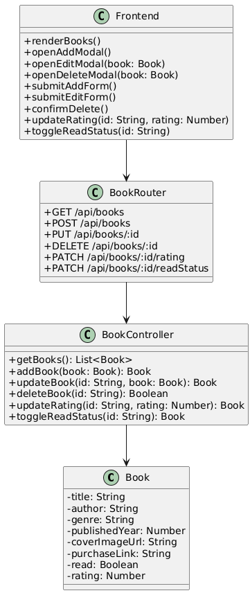

Book List API
Link: https://book-app-api-jdsw.onrender.com
----------------------------------------------------------------------------------------
A full-stack web application for managing a personal library. Users can add, edit, delete, and view books with dynamic sorting, filtering, and rating features. Designed with a poetic UI and cosmic aesthetic, this project blends modular Express routing, MongoDB persistence, and responsive frontend interactivity.

----------------------------------------------------------------------------------------
UML Class Diagram

----------------------------------------------------------------------------------------
Features

- Add new books via modal form
- Edit and delete existing entries
- Toggle read/unread status
- Rate books from 0 to 5 stars
- Sort by title, author, genre, year, rating, and status
- Responsive UI with Tailwind CSS
- Background image and themed styling

----------------------------------------------------------------------------------------

Tech Stack

- Frontend: HTML, Tailwind CSS, JavaScript
- Backend: Node.js, Express
- Database: MongoDB (Mongoose)
- Tools: RESTful API, modular routing, dynamic DOM rendering
- Deployed: Render

----------------------------------------------------------------------------------------
Reflection
----------------------------------------------------------------------------------------
This project began as a simple CRUD app but evolved into a poetic interface for storytelling through books. I focused on modularity, accessibility, and emotional resonance—ensuring each UI element felt intentional and expressive.
What I learned:
• 	How to structure Express routes for clarity and scalability
• 	DOM manipulation for dynamic rendering and modal logic
• 	Validating user input across frontend and backend
• 	Creating responsive layouts with Tailwind
• 	Debugging event listeners and asynchronous fetch logic
What I’m proud of:
• 	The modal-based UX that keeps the interface clean and focused
• 	The rating system with visual feedback and backend validation
• 	The cosmic-themed design that reflects my artistic vision
• 	Writing clear documentation and UML diagrams to support maintainability
Next steps:
• 	Add genre-based icons and animations
• 	Integrate analytics dashboard for reading trends
• 	Expand documentation with visual diagrams and API reference

Background
The background image is a bookshelf layered with stars, symbolizing the constellation of stories we carry. It sets the tone for a library that’s not just functional—but magical.

License
MIT License

